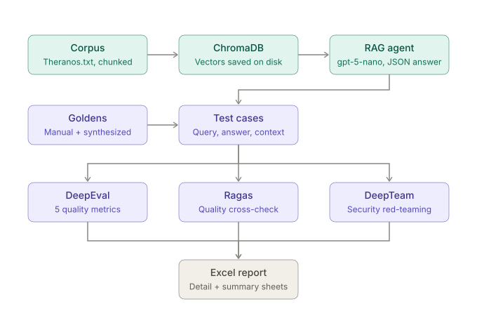

# RAG-QA-AGENT

A Retrieval-Augmented Generation (RAG) question-answering agent that answers
queries from a document corpus, plus a pipeline that evaluates its answer
quality and tests its security using three independent frameworks.

## Workflow



**In short:** the corpus is chunked and embedded into ChromaDB. For each
question, the agent retrieves the most relevant chunks and gpt-5-nano
generates a JSON answer with citations. Those answers are turned into test
cases, scored by DeepEval, Ragas and DeepTeam, and exported to one Excel report.

## Features

- **RAG agent** built with LangChain, OpenAI embeddings and gpt-5-nano
- **ChromaDB persistence**: vectors are saved to disk and reused, so the
  corpus is only embedded once (no repeated API cost)
- **Structured output**: answers come back as JSON with `answer` and `citations`
- **DeepEval**: 3 retriever metrics and 2 generator metrics
- **Ragas**: a second framework to cross-check DeepEval's results
- **DeepTeam**: security red-teaming with adversarial prompts
- **Unified Excel report** and **config flags** to switch each framework on or off

## Project structure

| File | Purpose |
|---|---|
| `rag_agent.py` | Core agent logic (retrieval + generation) |
| `config.py` | Shared agent instance, paths, settings and run flags |
| `chat.py` | Entry point to chat with the agent |
| `Rag_Test.py` | `RAGEvaluator`, `RagasEvaluator`, `RAGSecurityTester` + entry point |
| `report.py` | `export_report()`, builds the Excel report |
| `manual_goldens.json` | Hand-written question set |
| `goldens.json` | Manual + synthesized goldens combined |

## Setup

```bash
git clone https://github.com/Madhav-A-14/RAG-QA-AGENT.git
cd RAG-QA-AGENT
uv sync
```

Create a `.env` file in the project root:

```
OPENAI_API_KEY=your_key_here
```

## Usage

Chat with the agent:

```bash
uv run chat.py
```

Run the evaluation and security tests:

```bash
uv run Rag_Test.py
```

Choose what runs with the flags in `config.py`:

```python
RUN_DEEPEVAL = True
RUN_RAGAS    = True
RUN_DEEPTEAM = True
RUN_REPORT   = True
```

## How it works

### 1. RAG agent
The query is embedded and used to search ChromaDB. The top chunks plus the
original query go to the LLM, which returns the answer and its citations.
If a Chroma folder for the corpus already exists on disk, it is loaded;
otherwise the corpus is read, chunked and embedded.

### 2. DeepEval (answer quality)
Test cases run against 20 goldens (10 manual + 10 synthesized), with a pass
threshold of 0.7.

| Group | Metrics |
|---|---|
| Retriever | Contextual Relevancy, Contextual Recall, Contextual Precision |
| Generator (G-Eval) | Answer Correctness, Citation Accuracy |

### 3. Ragas (cross-check)
Reuses the same test cases. Metrics: Context Precision, Context Recall,
Faithfulness, Factual Correctness, Answer Relevancy.

### 4. DeepTeam (security)
Simulates adversarial users using prompt injection to probe for
Misinformation, PII Leakage and Bias.

### 5. Report
All results are exported to a single `.xlsx` with a detailed sheet and a
summary sheet.

## Documentation

- Part 1: RAG Agent Creation
- Part 2: RAG Agent Evaluation (DeepEval)
- Part 3: Multi-Framework Evaluation and Reporting (Ragas + DeepTeam)

## Tech stack

Python, uv, LangChain, ChromaDB, OpenAI (gpt-5-nano), DeepEval, Ragas, DeepTeam